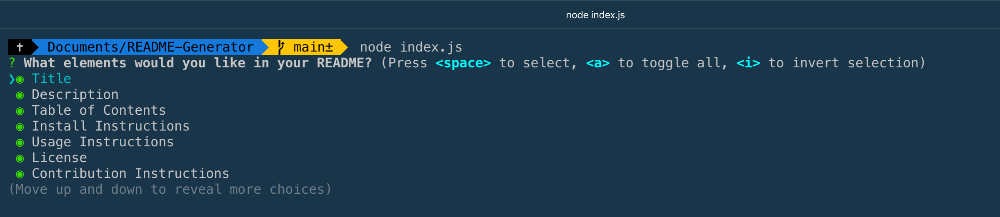
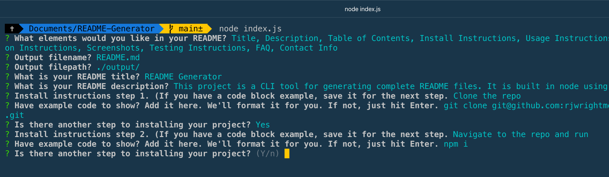

[](https://opensource.org/licenses/MIT)

# Command Line README Generator

This is a command line tool for generating a robust README for use on GitHub or elsewhere. It asks a series of questions in the terminal and then creates a formatted markdown file.

## Table of Contents

- [Installation](#installation)
- [Usage](#usage)
- [License](#license)
- [Contributing](#contributing)
- [Screenshots](#screenshots)
- [FAQ](#faq)
- [Contact](#contact)

## Installation

1. Clone this repo

```sh
git clone git@github.com:rjwrightme/CLI-README-generator.git
```

2. cd into the repo and run

```sh
npm install
```

## Usage

To run the app, simply type

```sh
node index.js
```

Then answer the questions. A README file will be saved at the location specified.

## License

Distributed under the MIT License. See `LICENSE` for more information.
[](https://opensource.org/licenses/MIT)

## Contributing

Any contributions you make are **greatly appreciated**. Just make sure to create a new branch first.

        1. Fork the Project

        2. Create your Feature Branch (`git checkout -b feature/AmazingFeature`)

        3. Commit your Changes (`git commit -m 'Add some AmazingFeature'`)

        4. Push to the Branch (`git push origin feature/AmazingFeature`)

        5. Open a Pull Request

## Screenshots




## FAQ

Q: Was this README file generated with this repo?

> A: Yes, it was.

Q: What if I don't want a certain section in my README file?

> A: All sections of the README are optional in the generator. Simply pick the ones that fit your project.

Q: Can I tweak my file after it's generated?

> A: Sure. The generated file is just a regular .md file, so open it up in your text editor and make changes if you wish.

## Contact

Have a burning question about this project? You can reach me at the following:

RJ Wright - rj@rjwright.me
[![twitter][twitter-shield]][twitter-url][![LinkedIn][linkedin-shield]][linkedin-url]

[linkedin-shield]: https://img.shields.io/badge/-LinkedIn-black.svg?style=flat-square&logo=linkedin&colorB=1178B3
[linkedin-url]: https://www.linkedin.com/in/rjwrightme/
[twitter-shield]: https://img.shields.io/badge/-Twitter-black.svg?style=flat-square&logo=twitter&logoColor=FFF&colorB=2AA3EF
[twitter-url]: https://twitter.com/rjwrightme
